# 📈 Digital Ads & Sales Analysis with Excel Regression

This project demonstrates a full-cycle exploratory and predictive analysis on a marketing dataset using **Microsoft Excel**. It includes handling missing data, managing outliers, and building a **linear regression model** to uncover the impact of advertising budgets (Google Ads, Meta, Influencer) on sales.

---

## 📂 Dataset Summary

The dataset contains the following variables:
- `GoogleAds`: daily budget spent on Google advertising
- `Meta`: daily budget spent on Meta (Facebook, Instagram)
- `Influencer`: influencer marketing spend
- `Sales`: observed daily sales outcome
- `ID` and `Date`: to track and sort rows

Initially, 5 missing values are found in the `Sales` column.

📷 
📷 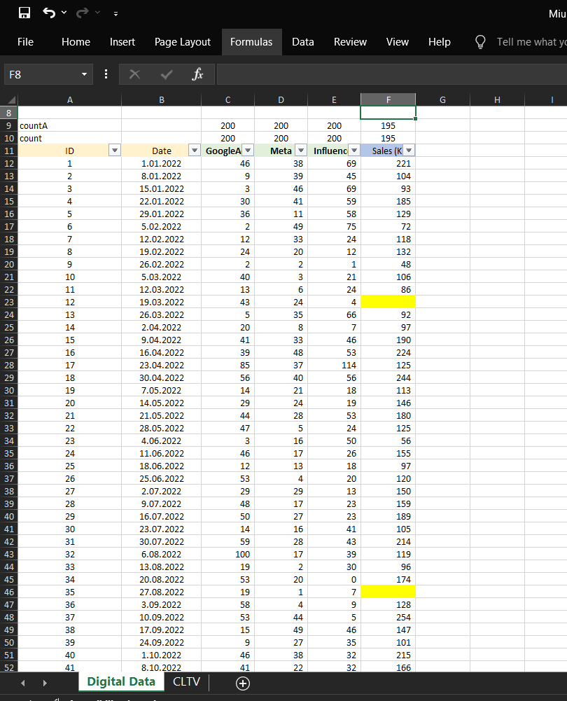

---

## 🧼 Handling Missing Values

### ➤ Step 1: Identifying Missing Data
We used `COUNTA` to detect missing values in the `Sales` column.

> 📌 5 missing entries found.

### ➤ Step 2: Should We Fill Missing `Sales`?
Typically in machine learning, we don't impute the **dependent variable** (here, `Sales`). But in this case, we experiment with different imputation strategies.

📷 

### ➤ Step 3: Median Imputation (Rejected)
Filling missing values with `Sales` median (129) is not ideal—ad spend varies significantly across rows.

📷 

---

## 📊 Correlation-Based Imputation

We analyzed correlation of `Sales` with each ad channel:
- GoogleAds: **0.67** (strongest correlation)

📷 
📷 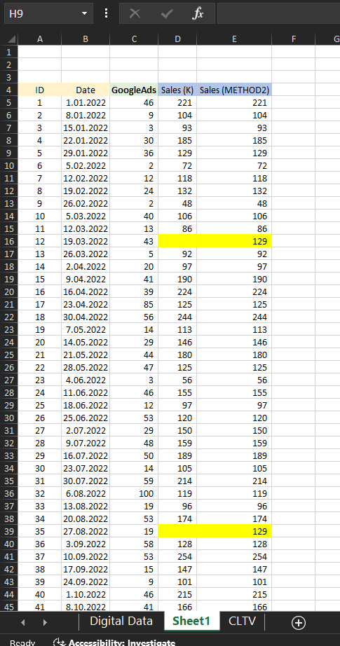

### ➤ Step 4: Imputation with GoogleAds-based Neighbors
We sorted by GoogleAds and for each missing `Sales`, took the **average of 3 above and 3 below** entries (in terms of GoogleAds values).

📷 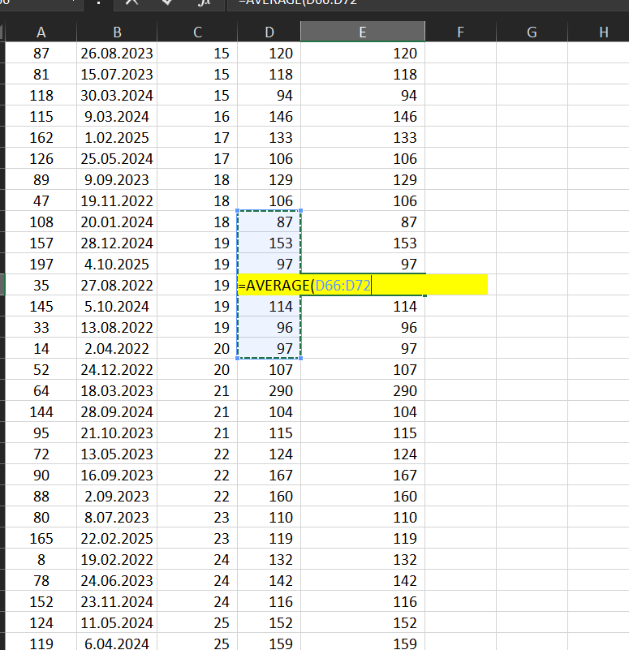
📷 
📷 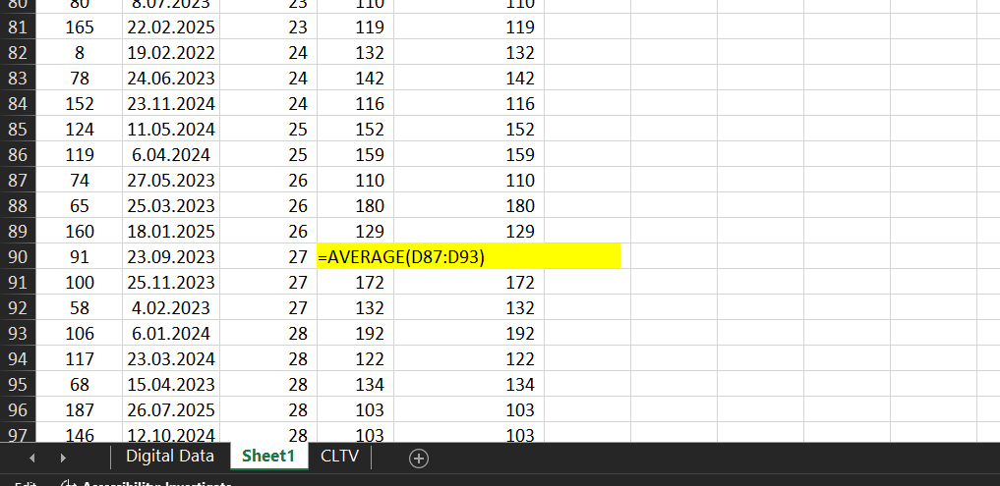
📷 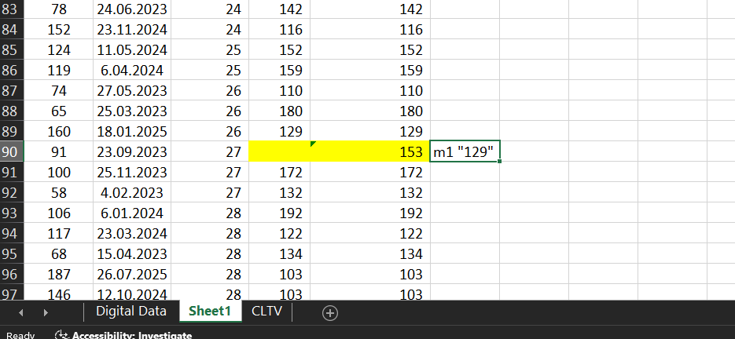
📷 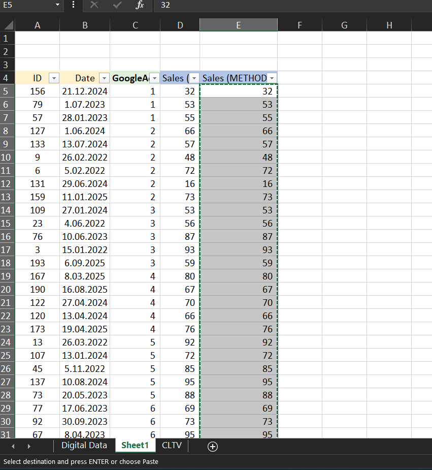

> 🧠 Example: A previous median-filled value of 129 improved to ~107 using this method.

---

## 🚨 Outlier Detection and Smoothing

### ➤ Step 5: Scatter Plot Visualization
We visualized GoogleAds vs. Sales to identify outliers using **scatter plots**.

📷 

### ➤ Step 6: Manual Capping Strategy
We capped extreme values to reduce their influence on regression slope:
- GoogleAds: values like 100 → 55, 70 → 20
- Sales: values like 290 → 150

📷 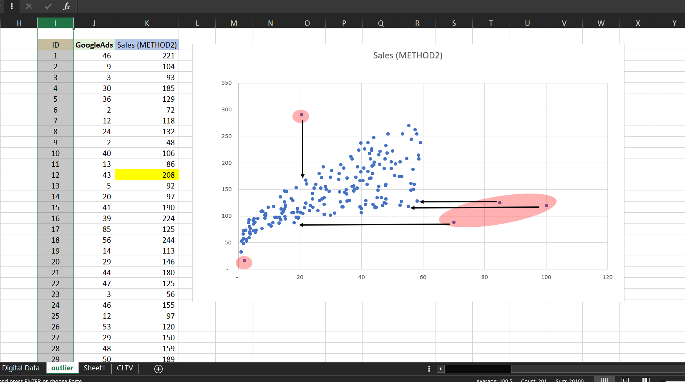
📷 
📷 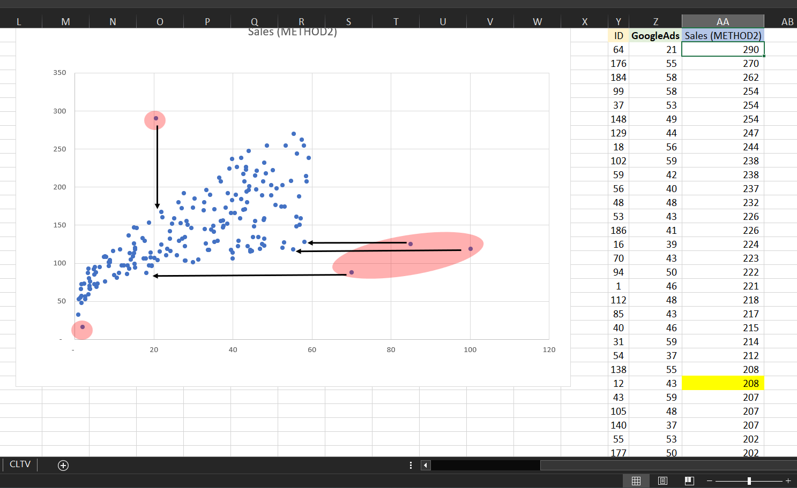

---

## 📉 Linear Regression in Excel

We used Excel’s **"Add Trendline"** and **Data Analysis Toolpak** to generate a **regression line**.

### 📘 Equation of the Line:

\[
y = 2.2613x + 72.627
\]

Where:
- `x` = Google Ads spend
- `y` = Predicted sales

📷 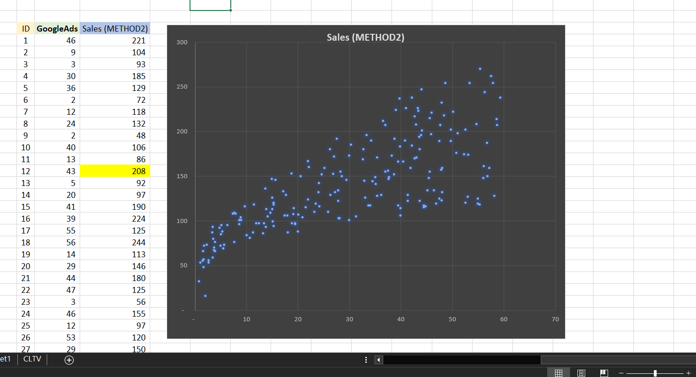
📷 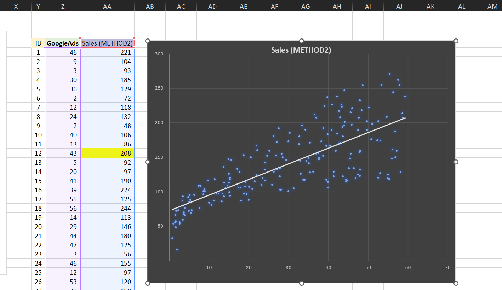

### 🧠 Interpretation:
| Term       | Meaning                                           |
|------------|----------------------------------------------------|
| `x`        | Google Ads (independent variable)                 |
| `y`        | Sales (dependent variable)                        |
| `2.2613`   | For every 1 unit increase in ads, sales rise 2.26 |
| `72.627`   | Even with 0 ad spend, baseline sales = 72.6       |

📷 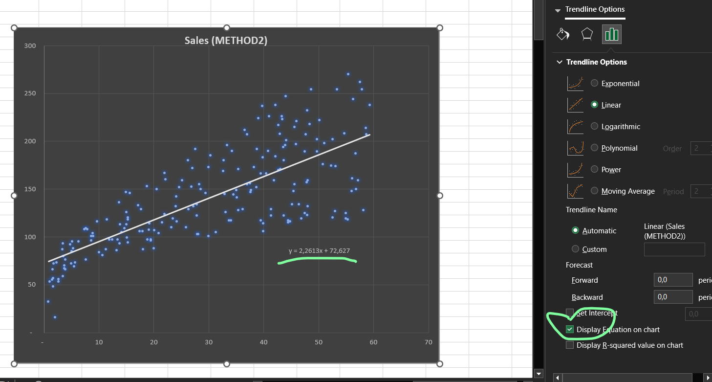
📷 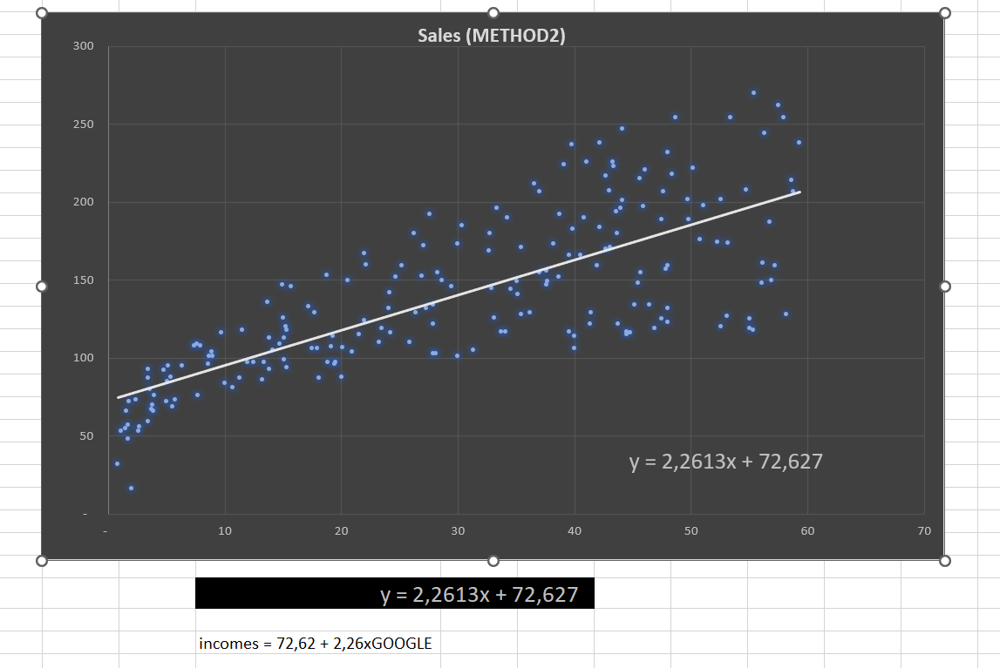
📷 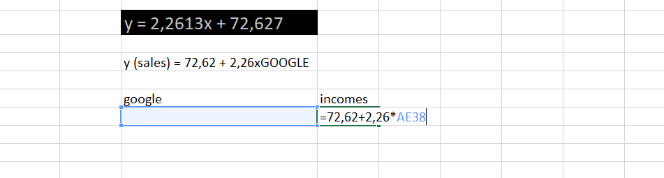
📷 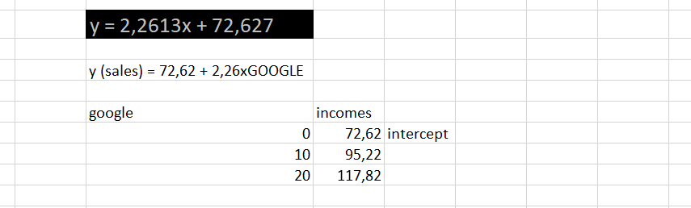

---

## 🔍 Predictive Examples

| Google Ads Spend (x) | Predicted Sales (y)           |
|----------------------|-------------------------------|
| 0                    | 72.63                         |
| 10                   | 95.24                         |
| 20                   | 117.85                        |
| 30                   | 140.47                        |

---

## 🧪 Tools Used

- Microsoft Excel
- Excel Data Analysis Toolpak
- Scatter Plots + Trendlines
- Correlation Analysis
- Manual Outlier Smoothing

📷 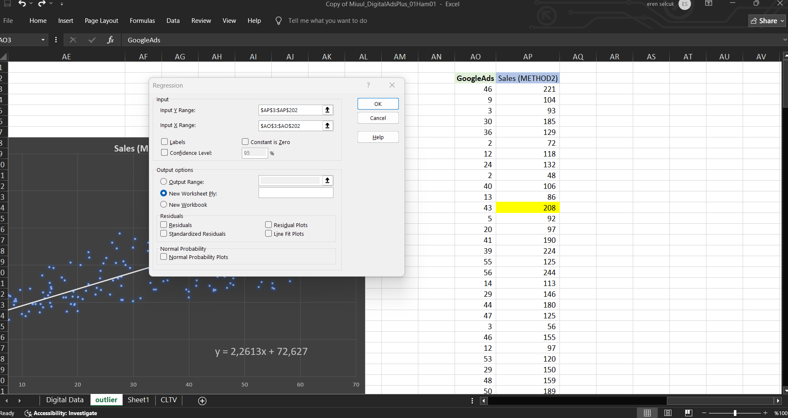
📷 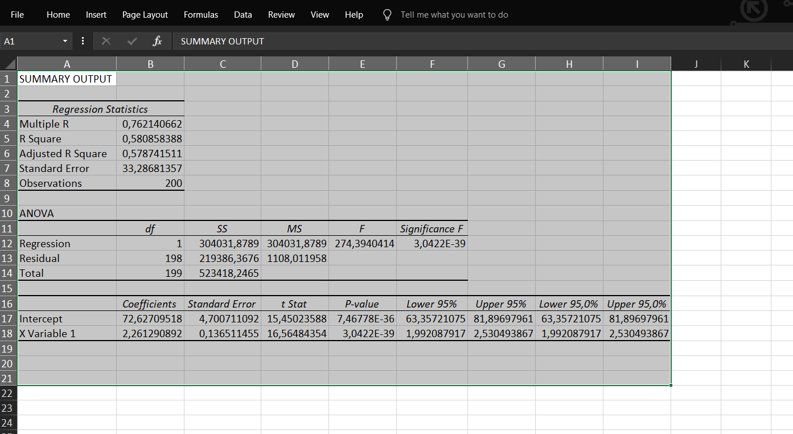

---
## ✅ Summary

This project reflects how **practical business analysis** is done using just Excel:
- Exploratory data analysis
- Visual analytics
- Strategic imputation
- Outlier management
- Simple regression modeling

A great example of lightweight yet effective marketing analytics.

---

Feel free to ⭐ star this repo or fork it to enhance it with Python, Power BI, or Google Sheets implementations!
