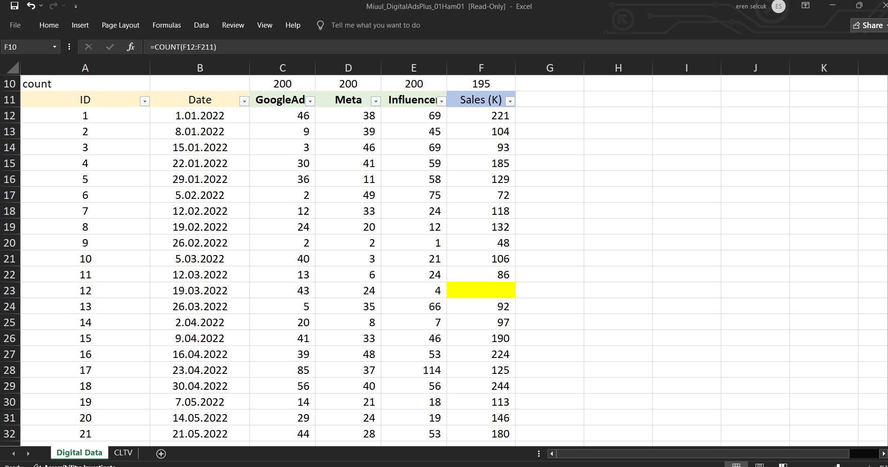
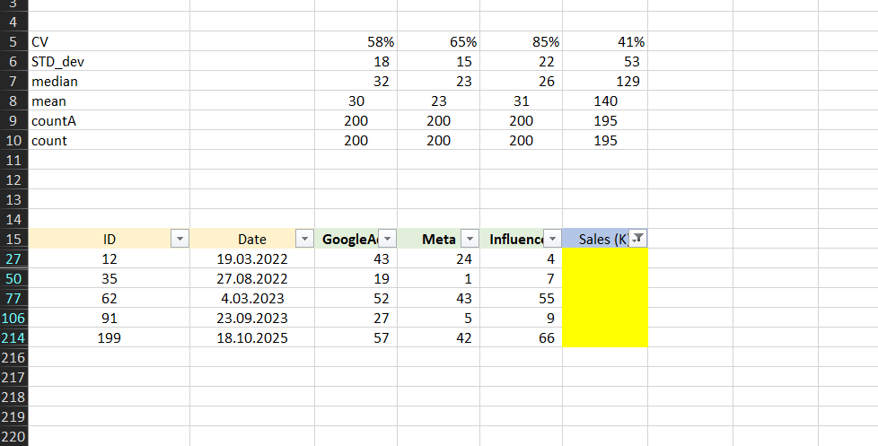
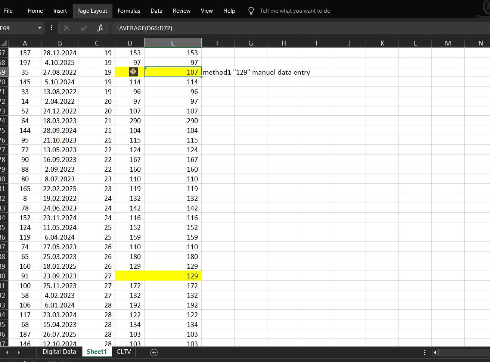
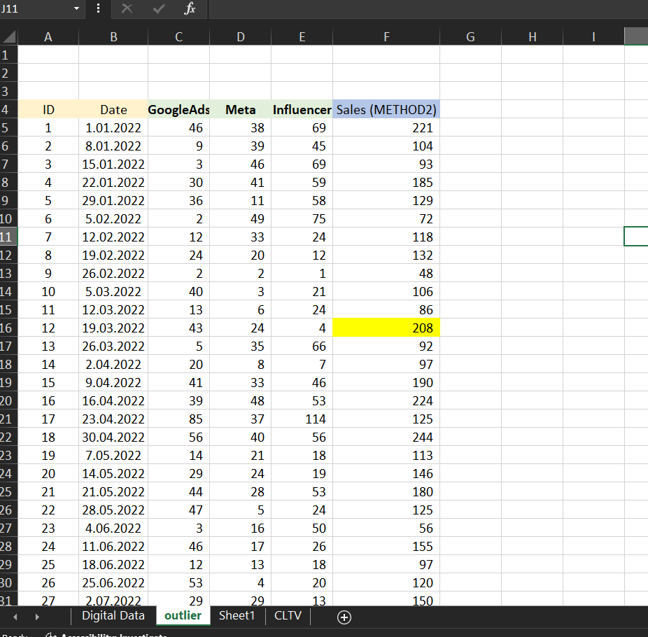
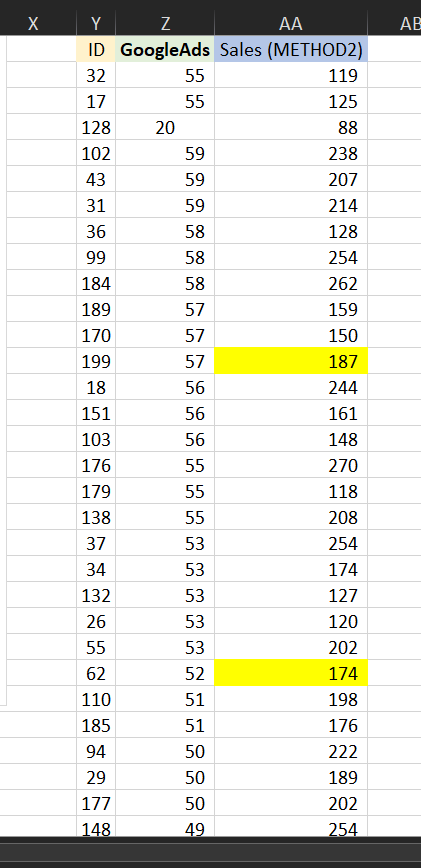

# digitalAds-Regression
# 📈 Digital Ads & Linear Regression Project

This project explores how **advertising spend** affects **sales**, using Excel-based data cleaning and linear regression modeling. Missing values, outliers, and regression coefficients are handled step-by-step to gain business insights from digital advertising data.

---

## 📊 Dataset Overview

The dataset contains:
- `GoogleAds`, `Meta`, `Influencer` → Daily advertising spend
- `Sales` → Corresponding daily sales

We noticed **5 missing values** in the `Sales` column.

📷 

---

## 🧹 Handling Missing Sales Values

### Method 1: Mean or Median Imputation?

📌 We consider filling missing `Sales` values using **mean** or **median** — but this ignores relationships with ad spend.

📷 

---

### Method 2: Correlation-Based Imputation

We compute the **correlation between ad channels and sales**:
- `GoogleAds` shows the **strongest correlation (~0.67)**.

📷 

So, we sort the table by `GoogleAds`, and fill missing `Sales` using the **average of 3 rows above and below** the missing entries.

📷 

---

## 🔎 Detecting and Treating Outliers

We use **scatter plots** to visualize outliers in `GoogleAds` vs. `Sales`.

📷 

Extreme values like 100 or 290 are compressed to more moderate levels like 55 or 150.

📷 

This creates a more robust dataset for regression.

---

## 📉 Linear Regression: GoogleAds vs Sales

Using Excel's "Add Trendline" tool and Data Analysis add-in, we compute a **linear regression equation**:

```math
y = 2.2613x + 72.627
```
Where:

x = Google Ads spend

y = Sales

📷

🔍 Interpretation
Slope (2.26) → Every extra 1 unit spent on Google Ads brings ~2.26 units in Sales

Intercept (72.62) → Even with 0 spend, baseline sales = 72.62 (from loyal customers etc.)

💡 Predictive Examples
| Google Ads Spend (x) | Expected Sales (y)            |
| -------------------- | ----------------------------- |
| 0                    | 72.62                         |
| 10                   | 2.2613 × 10 + 72.627 = 95.24  |
| 30                   | 2.2613 × 30 + 72.627 = 140.47 |


📘 Summary

| Term   | Meaning                                    | Seen On Chart?     |
| ------ | ------------------------------------------ | ------------------ |
| x      | Google Ads spend (Independent Variable)    | X-axis             |
| y      | Sales (Dependent Variable)                 | Y-axis             |
| 2.2613 | Slope – impact per unit of ad spend        | Trendline slope    |
| 72.627 | Intercept – base sales without advertising | Not always visible |

📷

🛠 Tools Used
Microsoft Excel

Data Analysis Toolpak

Scatter Plot + Trendline

Correlation, Imputation, Outlier Handling

